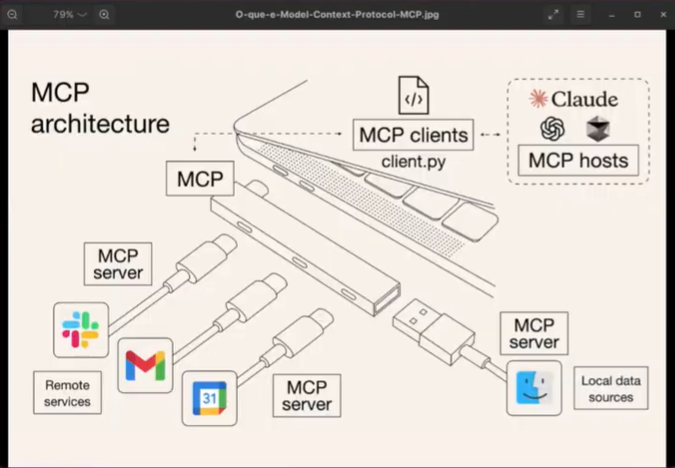

# mcp-cep-python
VEJA COMO É FÁCIL CRIAR UM SERVIDOR MCP! - FastMCP + Python url: https://www.youtube.com/watch?v=K5t-yJDzpGQ


# MCP SERVER
Criação de um MCP Server (com python e FastMCP) simples com um tool que busca cep utilizando a api [BuscaCep](https://viacep.com.br/): 


# Como rodar?

1-) Crie um ambiente no python de "env":
```
python -m venv env
```

2-) Ative o ambiente "env" criado:
```
./env/scripts/activate
```

3-) Instale pacote do FastMCP:
```
pip install fastmcp
```

4-) Instale pacote requests:
```
pip install requests
```

5-) Salve todas as dependências em um arquivo txt
```
pip freeze >  requirements.txt
```


